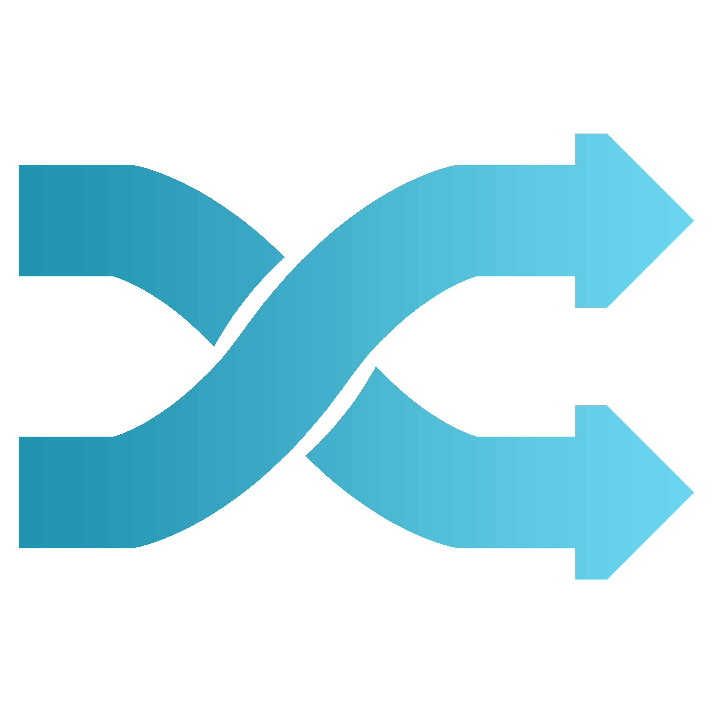

<!--
*** Thanks for checking out the Best-README-Template. If you have a suggestion*** that would make this better, please fork the repo and create a pull request*** or simply open an issue with the tag "enhancement".*** Thanks again! Now go create something AMAZING! :D************ To avoid retyping too much info. Do a search and replace for the following:*** github_username, repo_name, twitter_handle, email, project_title, project_description
-->

<!-- PROJECT SHIELDS -->
<!--
*** I'm using markdown "reference style" links for readability.
*** Reference links are enclosed in brackets [ ] instead of parentheses ( ).
*** See the bottom of this document for the declaration of the reference variables
*** for contributors-url, forks-url, etc. This is an optional, concise syntax you may use.
*** https://www.markdownguide.org/basic-syntax/#reference-style-links
-->
  
[![Contributors][contributors-shield]][contributors-url]
[![Forks][forks-shield]][forks-url]
[![Stargazers][stars-shield]][stars-url]
[![Issues][issues-shield]][issues-url]

**NO LICENSE. All rights reserved.**

<!-- PROJECT LOGO -->
 

  

  <h3 align="center">Crosstalk</h3>

  

    A web-based instant messaging platform built with Node.js and Socket.IO
     
     
    <a href="https://github.com/Rusty3141/Crosstalk/issues">Report Bug</a>
    ·
    <a href="https://github.com/Rusty3141/Crosstalk/issues">Request Feature</a>
  

<!-- TABLE OF CONTENTS -->

  
<h2 style="display: inline-block">Table of Contents</h2>

  <ol>
    <li>
      <a href="#about-the-project">About The Project</a>
      <ul>
        <li><a href="#built-with">Built With</a></li>
      </ul>
    </li>
    <li><a href="#acknowledgements">Acknowledgements</a></li>
  </ol>

<!-- ABOUT THE PROJECT -->
## About The Project

![Login Screen Shot][login-screenshot]
A screenshot of the project login screen.

![Chat Screen Shot][chat-screenshot]
A screenshot of the project chat screen.

### Built With

* [Node.js](https://nodejs.org/en/)
* [Argon2](https://www.npmjs.com/package/argon2)
* [Async](https://www.npmjs.com/package/async)
* [body-parser](https://www.npmjs.com/package/body-parser)
* [Chart.js](https://www.chartjs.org/)
* [dotenv](https://www.npmjs.com/package/dotenv)
* [Express](https://www.npmjs.com/package/express)
* [express-mysql-session](https://www.npmjs.com/package/express-mysql-session)
* [express-session](https://www.npmjs.com/package/express-session)
* [log4js](https://www.npmjs.com/package/log4js)
* [MySQL](https://www.npmjs.com/package/mysql)
* [Nodemailer](https://www.npmjs.com/package/nodemailer)
* [particles.js](https://github.com/VincentGarreau/particles.js/)
* [Socket.IO](https://www.npmjs.com/package/socket.io)
* [socket.io-stream](https://www.npmjs.com/package/socket.io-stream)

<!-- ACKNOWLEDGEMENTS -->
## Acknowledgements

* README.md adapted from [https://github.com/othneildrew/Best-README-Template](https://github.com/othneildrew/Best-README-Template)

<!-- MARKDOWN LINKS & IMAGES -->
<!-- https://www.markdownguide.org/basic-syntax/#reference-style-links -->
[contributors-shield]: https://img.shields.io/github/contributors/Rusty3141/Crosstalk.svg?style=for-the-badge
[contributors-url]: https://github.com/Rusty3141/Crosstalk/graphs/contributors
[forks-shield]: https://img.shields.io/github/forks/Rusty3141/Crosstalk.svg?style=for-the-badge
[forks-url]: https://github.com/Rusty3141/Crosstalk/network/members
[stars-shield]: https://img.shields.io/github/stars/Rusty3141/Crosstalk.svg?style=for-the-badge
[stars-url]: https://github.com/Rusty3141/Crosstalk/stargazers
[issues-shield]: https://img.shields.io/github/issues/Rusty3141/Crosstalk.svg?style=for-the-badge
[issues-url]: https://github.com/Rusty3141/Crosstalk/issues
[license-shield]: https://img.shields.io/github/license/Rusty3141/Crosstalk.svg?style=for-the-badge
[license-url]: https://github.com/Rusty3141/Crosstalk/blob/main/LICENSE.txt
[login-screenshot]: https://github.com/Rusty3141/Crosstalk/blob/main/Documentation/Images/login.html.blank.png?raw=true
[chat-screenshot]: https://github.com/Rusty3141/Crosstalk/blob/main/Documentation/Images/chat.html.anon.png?raw=true
